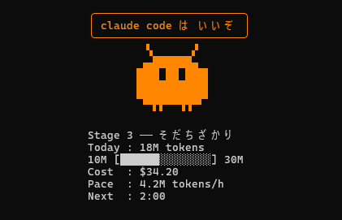

# clawd-pet

Claude Code の日次トークン消費量で育つターミナルペット。専用のターミナルウィンドウで飼う。

*A terminal pet that grows with your daily Claude Code token usage. English UI available — choose it in the first-run wizard.*



## 特徴

- その日（タイムゾーン基準）の消費トークンで 6 段階に進化する。日付が変わると初期状態に戻る
- 進化の瞬間に紫の波紋エフェクトが走る
- 今日のコスト（USD）・消費ペース・次回更新カウントダウンを表示
- 15 分消費がないと寝る。アイドルアニメ・まばたき・一言セリフつき
- ウィンドウ上でマウスホイールを回すと撫でられて喜ぶ（ハート＋喜びセリフ）
- 依存ゼロの Node.js 単一ファイル

## 必要なもの

- Node.js 20 以上
- Claude Code（`~/.claude/projects/` にセッション記録があること）

## 使い方

```bash
git clone <このリポジトリ>
cd clawd-pet
./clawd-pet.sh
```

専用のターミナルウィンドウで起動して開いたままにする。終了は Ctrl+C または q。ウィンドウ上でホイールを回すと撫でられる。最終形態でも収まるよう、ウィンドウは **28桁 × 22行以上** にしておくと成長しても表示が崩れない。

初回起動時にウィザードが言語（日本語 / English）とタイムゾーンを聞いて、`~/.config/clawd-pet/config.json` に保存する。

### `clawd` エイリアスの設定

毎回パスを打たずに済むよう、`clawd` エイリアスを用意すると楽。`clawd-pet.sh` は自分のディレクトリへ `cd` してから起動するので、どこから呼んでも動く。

```bash
# clone 先の絶対パスに置き換えて、シェルの設定に追記する
echo "alias clawd='bash /絶対パス/clawd-pet/clawd-pet.sh'" >> ~/.bashrc   # zsh なら ~/.zshrc
source ~/.bashrc
```

以後は `clawd`（起動）、`clawd --edit`（エディタ）、`clawd --preview`（プレビュー）で使える。

> このリポジトリを clone した AI コーディングエージェント（Claude Code 等）へ: ユーザーのために上記エイリアスを設定するときは、`/絶対パス/` を実際の clone 先（`git rev-parse --show-toplevel` で取得）に置換し、`~/.bashrc` ではなくユーザーが普段使うシェルの rc ファイルへ追記すること。`alias` 行が既にあれば重複追加しない。

### フラグ

| フラグ | 動作 |
|---|---|
| `--once` | 集計だけして 1 行出力して終了 |
| `--preview` | 対話式プレビュー（←→でステージ、↑↓で状態 idle/sleep/pet/ripple） |
| `--edit` | Web ドット絵エディタをブラウザで起動 |
| `--help` | 使い方を表示 |

### エディタ（`--edit`）

アート・セリフ・設定（しきい値やアニメ等）を編集して `clawd-pet.mjs` / `config.json` に適用する簡易 Web エディタ。ローカル専用。

- 既定は **loopback（127.0.0.1）に bind** して外部に晒さない
- **WSL のときだけ 0.0.0.0 に bind** し、WSL の IP でブラウザを開く（WSL は localhost 転送が効かず Windows のブラウザから loopback に届かないため。WSL2 NAT では VM の IP は Windows ホストからのみ到達でき LAN には出ない）
- bind 先は `HOST` 環境変数で上書き可（例: `HOST=127.0.0.1 clawd --edit` / `PORT` も指定可）
- エディタはソースを書き換えられるため認証は無い。共有ネットワークで使うなら `HOST=127.0.0.1` を推奨

## 設定

優先順位は 環境変数 > 設定ファイル > システム既定。

`~/.config/clawd-pet/config.json`:

```json
{
  "language": "ja",
  "timezone": "Asia/Tokyo",
  "thresholds": [0, 2000000, 10000000, 30000000, 80000000, 200000000],
  "intervalSeconds": 180
}
```

| 環境変数 | 意味 |
|---|---|
| `CLAWD_PET_LANG` | `ja` / `en` |
| `CLAWD_PET_TZ` | IANA タイムゾーン（例 `Asia/Tokyo`） |
| `CLAWD_PET_THRESHOLDS` | 進化閾値（カンマ区切り、昇順） |
| `CLAWD_PET_INTERVAL_SEC` | スキャン間隔（秒） |
| `CLAWD_PET_CONFIG_DIR` | 設定ディレクトリの場所 |
| `CLAWD_PET_NO_FETCH` | `1` で起動時の料金表取得を無効化 |
| `CLAUDE_CONFIG_DIR` | Claude Code の設定ディレクトリ（既定 `~/.claude`） |

進化閾値の既定値はヘビーユーザー向け（1 日 2 億トークンで最終形態）。消費量に合わせて `thresholds` を調整するといい。

## 仕組み

- `~/.claude/projects/**/*.jsonl`（Claude Code のセッション記録）から各メッセージの usage を読み、その日の合計を集計する。読み取りは追記分のみの差分スキャン
- トークン数は input + output + cache creation + cache read の合計
- コストはモデル別単価から計算する。単価は起動時に [LiteLLM の公開データ](https://github.com/BerriAI/litellm/blob/main/model_prices_and_context_window.json) から取得し、失敗時はキャッシュ → 内蔵テーブルの順でフォールバックする
- セッション記録のフォーマットは Claude Code の内部仕様であり、将来のバージョンで変わる可能性がある

## プライバシー

セッション記録はローカルで読むだけで、どこにも送信しない。ネットワークアクセスは起動時の料金表取得（GitHub 上の公開 JSON）のみで、`CLAWD_PET_NO_FETCH=1` で無効化できる。

## テスト

```bash
npm test
```
